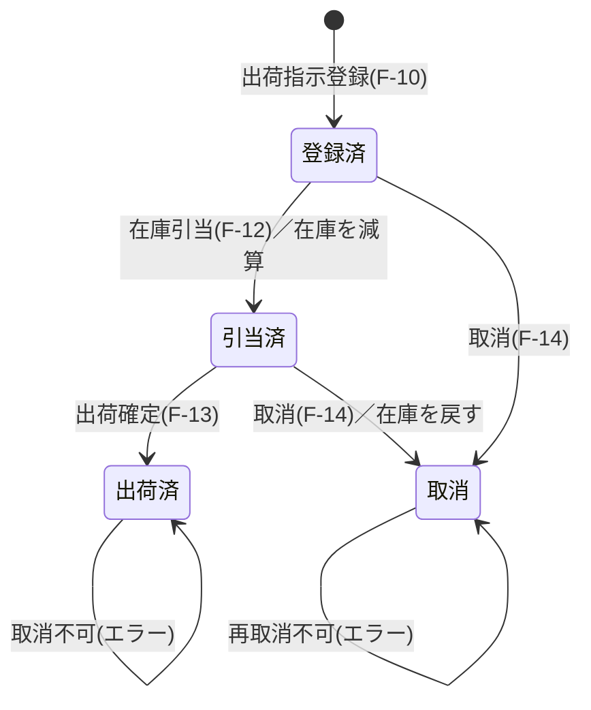

# 02. 機能仕様

## 2.1 機能一覧

| ID | 機能名 | 概要 | 実装 |
|---|---|---|---|
| F-01 | ダッシュボード表示 | 出荷ステータス別件数と安全在庫割れ一覧を表示 | `DashboardController#index` |
| F-02 | 商品検索 | 条件(キーワード/カテゴリ/価格帯/並び順)で商品を検索 | `ItemService#search` |
| F-03 | 商品登録 | 商品マスタへ新規登録 | `ItemService#create` |
| F-04 | 商品更新 | 商品マスタを更新 | `ItemService#update` |
| F-05 | 商品削除 | 商品マスタから削除 | `ItemService#delete` |
| F-06 | 在庫照会 | 倉庫で絞り込んだ在庫一覧を表示 | `StockService#findByWarehouse` |
| F-07 | 入庫 | 指定商品・倉庫の在庫数量を加算 | `StockService#receive` |
| F-08 | 安全在庫割れ抽出 | 在庫数が安全在庫を下回る在庫を抽出 | `StockService#findBelowSafetyStock` |
| F-09 | 出荷指示検索 | 条件(出荷先/倉庫/ステータス/出荷日範囲)で検索 | `ShipmentService#search` |
| F-10 | 出荷指示登録 | ヘッダ＋明細を登録し、出荷番号を採番 | `ShipmentService#create` |
| F-11 | 出荷指示照会 | ヘッダ・明細・商品情報を表示 | `ShipmentService#findById` |
| F-12 | 在庫引当 | 明細の数量だけ在庫を減算し、ステータスを引当済へ | `ShipmentService#allocate` |
| F-13 | 出荷確定 | ステータスを出荷済へ | `ShipmentService#ship` |
| F-14 | 出荷指示取消 | ステータスを取消へ。引当済なら在庫を戻す | `ShipmentService#cancel` |
| F-15 | 出荷指示削除 | 明細ごと削除。引当済なら在庫を戻す | `ShipmentService#delete` |

## 2.2 業務フロー

### 2.2.1 出荷業務の基本フロー

```
[F-10 出荷指示登録]        ヘッダ＋明細を登録。この時点では在庫は動かない
        ↓  status = 登録済(10)
[F-12 在庫引当]            明細の数量だけ在庫を減算
        ↓  status = 引当済(20)
[F-13 出荷確定]            出荷完了として確定
        ↓  status = 出荷済(30)
       終了
```

取消の分岐:

```
登録済(10) ──[F-14 取消]──→ 取消(90)     在庫操作なし
引当済(20) ──[F-14 取消]──→ 取消(90)     在庫を戻す(増加)
出荷済(30) ──[F-14 取消]──→ ×エラー
```

### 2.2.2 出荷ステータスの状態遷移



| 遷移元 | 操作 | 遷移先 | 在庫への影響 | 遷移元が不正な場合 |
|---|---|---|---|---|
| 登録済(10) | 引当 | 引当済(20) | 明細の数量だけ**減算** | エラー「引当できるのは「登録済」の出荷指示のみです」 |
| 引当済(20) | 出荷 | 出荷済(30) | なし | エラー「出荷できるのは「引当済」の出荷指示のみです」 |
| 登録済(10) | 取消 | 取消(90) | なし | ― |
| 引当済(20) | 取消 | 取消(90) | 明細の数量だけ**加算**(戻し) | ― |
| 出荷済(30) | 取消 | ― | ― | エラー「出荷済の出荷指示は取消できません」 |
| 取消(90) | 取消 | ― | ― | エラー「すでに取消済です」 |
| 全ステータス | 削除 | (レコード削除) | 引当済のみ**加算**(戻し) | ― |

> **注意**: 削除(F-15)はステータスによる制限を設けていない。出荷済の伝票も削除できる仕様。

## 2.3 機能別 業務ルール

### F-02 商品検索

- 検索条件はすべて任意。未入力の条件は WHERE 句に含めない(動的SQL)。
- キーワードは**商品名または商品コード**の部分一致(大文字小文字を区別しない)。
- 並び順は下表のホワイトリストで変換する。未指定・不正値は既定値(商品コード昇順)に倒す。
  画面から渡された文字列をそのまま SQL に埋め込まないことで SQL インジェクションを防ぐ。

| 画面の指定値 | ORDER BY に渡す文字列 |
|---|---|
| `code` | `item_code` |
| `name` | `item_name` |
| `price` | `unit_price DESC` |
| `category` | `category, item_code` |
| 未指定・上記以外 | `item_code`(既定) |

### F-03 / F-04 商品登録・更新

- 商品コードは全商品で一意。重複時はエラー。
  更新時は自分自身のレコードは重複チェックの対象外とする。
- `created_at` は登録時にDB側で `CURRENT_TIMESTAMP` を設定。更新時は変更しない。

### F-05 商品削除

- 在庫または出荷明細から参照されている商品は、外部キー制約により削除できない。
  DB の制約違反(`DataIntegrityViolationException`)を捕捉し、業務エラーに変換して画面に表示する。

### F-07 入庫

- 入庫数は1以上。0以下はエラー。
- 対象の在庫レコードが存在すれば数量を加算し、`updated_at` を更新する。
- 存在しない(更新件数0件)場合は、在庫レコードを新規作成する。

### F-08 安全在庫割れ抽出

- 抽出条件: `在庫数 < 商品の安全在庫`
- 並び順: 不足数(安全在庫 − 在庫数)の降順

### F-10 出荷指示登録

- **出荷番号の採番**: `SH-{出荷予定日:yyyyMMdd}-{連番3桁}`
  - 例: `SH-20261005-001`
  - 同一プレフィックス(同じ出荷予定日)の既存最大値に +1 する。存在しなければ 001。
- **明細のマージ**: 同一商品が複数行に入力された場合、1行に集約して数量を合算する。
- **空行のスキップ**: 商品未選択、数量が null または 0以下 の明細行は登録対象から除外する。
- スキップ後に明細が0件になった場合はエラー。
- 明細に存在しない商品IDが指定されている場合はエラー。
- 登録時のステータスは必ず **登録済(10)**。在庫は変動しない。
- ヘッダ INSERT →明細の一括 INSERT を**1トランザクション**で実行する。

### F-12 在庫引当

- 対象は **登録済(10)** の出荷指示のみ。
- 明細ごとに、出荷元倉庫の在庫を数量分減算する。
- 在庫の減算は `UPDATE stock SET quantity = quantity - ? WHERE ... AND quantity >= ?` で行い、
  **更新件数が0件なら在庫不足**と判定する(SELECT で残数確認→UPDATE より競合に強い)。
- 1行でも在庫不足があれば例外を投げ、**トランザクション全体をロールバック**する。
  これにより「一部の明細だけ在庫が減った」状態は発生しない。
- 全明細の減算に成功した場合のみ、ステータスを引当済(20)に更新する。

### F-14 / F-15 取消・削除

- 引当済(20)の場合のみ、明細の数量だけ在庫を戻す(加算)。
- 削除時は明細を先に削除してからヘッダを削除する
  (テーブル定義上は `ON DELETE CASCADE` も設定済み)。

## 2.4 業務エラーメッセージ一覧

すべて `BusinessException` として送出される。
画面操作ではエラー画面またはフォーム上に表示し、API では HTTP 400 と JSON で返す。

| # | メッセージ | 発生条件 | 発生箇所 |
|---|---|---|---|
| E-01 | 商品が見つかりません (id=◯) | 存在しない商品IDを指定 | `ItemService#findById` |
| E-02 | 商品コードが重複しています: ◯◯ | 登録・更新時に商品コードが既存と重複 | `ItemService#create/update` |
| E-03 | 在庫または出荷明細で使用中のため削除できません | 参照されている商品の削除 | `ItemService#delete` |
| E-04 | 入庫数は1以上で指定してください | 入庫数が0以下 | `StockService#receive` |
| E-05 | 出荷指示が見つかりません (id=◯) | 存在しない出荷指示IDを指定 | `ShipmentService#findById` |
| E-06 | 明細を1行以上入力してください | 有効な明細が0件 | `ShipmentService#create` |
| E-07 | 存在しない商品が指定されています (id=◯) | 明細に不正な商品ID | `ShipmentService#create` |
| E-08 | 引当できるのは「登録済」の出荷指示のみです(現在: ◯◯) | 登録済以外で引当 | `ShipmentService#allocate` |
| E-09 | 在庫が不足しています: ◯◯ (要求数 N) | 引当時に在庫不足 | `ShipmentService#allocate` |
| E-10 | 出荷できるのは「引当済」の出荷指示のみです(現在: ◯◯) | 引当済以外で出荷 | `ShipmentService#ship` |
| E-11 | 出荷済の出荷指示は取消できません | 出荷済の取消 | `ShipmentService#cancel` |
| E-12 | すでに取消済です | 取消済の再取消 | `ShipmentService#cancel` |
| E-13 | 不正な操作です: ◯◯ | API で未定義のアクション名を指定 | `ShipmentApiController` |

### 入力チェックエラー

Bean Validation によるチェック。詳細は [03-screen-spec.md](03-screen-spec.md) を参照。

| 対象 | メッセージ |
|---|---|
| 商品コード | 商品コードは必須です |
| 商品名 | 商品名は必須です |
| カテゴリ | カテゴリは必須です |
| 単価 | 単価は必須です / 単価は0以上で入力してください |
| 安全在庫 | 安全在庫は必須です / 安全在庫は0以上で入力してください |
| 出荷先 | 出荷先は必須です |
| 出荷元倉庫 | 出荷元倉庫を選択してください |
| 出荷予定日 | 出荷予定日は必須です |
| 明細 | 明細を1行以上入力してください |
| 明細.商品 | 商品を選択してください |
| 明細.数量 | 数量は必須です / 数量は1以上で入力してください |
