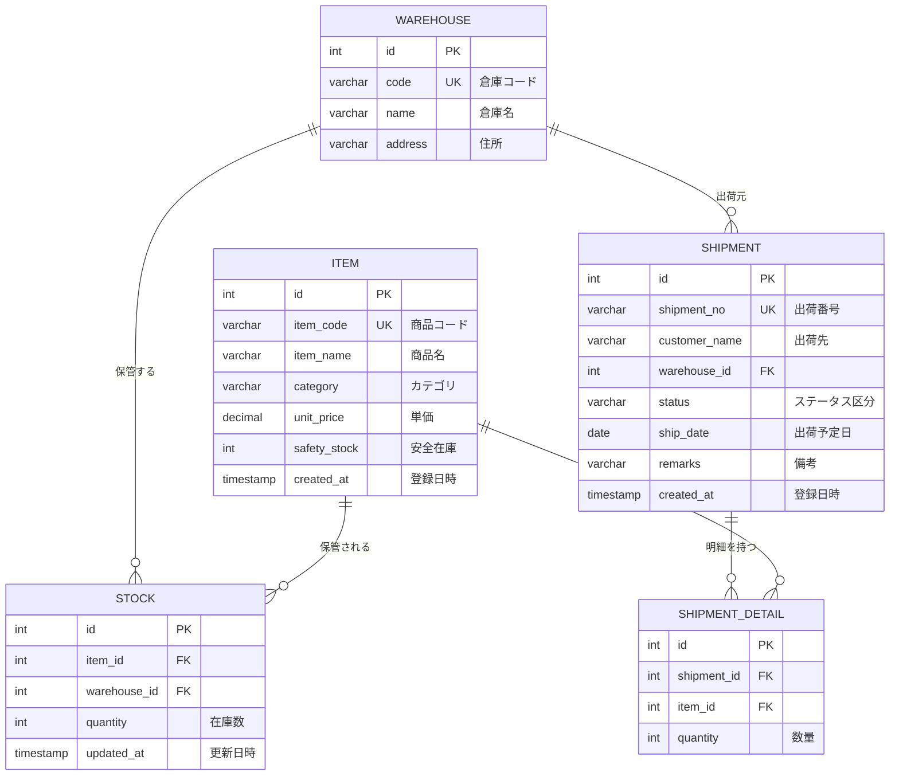

# 04. データベース仕様

## 4.1 DB 概要

| 項目 | 値 |
|---|---|
| DBMS | H2 Database 2.2.224(組込み・ファイルモード) |
| DBファイル | `data/scmdb.mv.db` |
| JDBC URL | `jdbc:h2:file:./data/scmdb;AUTO_SERVER=TRUE;DB_CLOSE_DELAY=-1` |
| ユーザー / パスワード | `sa` / (空) |
| スキーマ | `PUBLIC`(既定) |
| DDL | `src/main/resources/schema.sql`(起動時に実行) |
| 初期データ | `src/main/resources/data.sql`(起動時に実行) |

### 初期化ポリシー

`spring.sql.init.mode: always` により、**起動のたびに** `schema.sql` → `data.sql` が実行される。
両ファイルとも**何度実行しても結果が変わらない**書き方(冪等)にしてあるため、既存データは失われない。

| ファイル | 冪等性の担保方法 |
|---|---|
| `schema.sql` | `CREATE TABLE IF NOT EXISTS` |
| `data.sql` | `INSERT ... SELECT ... WHERE NOT EXISTS (SELECT 1 FROM 対象テーブル)` |

> **初期データ投入時に ID を明示しない理由**
> H2 では ID を直接指定して INSERT すると AUTO_INCREMENT の採番カウンタが進まない。
> その状態で画面から新規登録すると ID が 1 から採番され、主キー違反になる。
> このため `data.sql` は ID を採番に任せ、他テーブルからの参照は
> 商品コード・倉庫コードで解決している。

DBを初期状態に戻したい場合は、`data` フォルダごと削除してから起動する。

## 4.2 ER 図

## 4.3 テーブル定義

### 4.3.1 warehouse(倉庫マスタ)

| # | カラム | 型 | NOT NULL | 既定値 | 説明 |
|---|---|---|---|---|---|
| 1 | id | INT | ○ | AUTO_INCREMENT | 主キー |
| 2 | code | VARCHAR(10) | ○ | ― | 倉庫コード(一意) |
| 3 | name | VARCHAR(100) | ○ | ― | 倉庫名 |
| 4 | address | VARCHAR(200) | ― | ― | 住所 |

- PK: `id` / UK: `code`

### 4.3.2 item(商品マスタ)

| # | カラム | 型 | NOT NULL | 既定値 | 説明 |
|---|---|---|---|---|---|
| 1 | id | INT | ○ | AUTO_INCREMENT | 主キー |
| 2 | item_code | VARCHAR(20) | ○ | ― | 商品コード(一意) |
| 3 | item_name | VARCHAR(100) | ○ | ― | 商品名 |
| 4 | category | VARCHAR(50) | ○ | ― | カテゴリ |
| 5 | unit_price | DECIMAL(12,2) | ○ | ― | 単価 |
| 6 | safety_stock | INT | ○ | 0 | 安全在庫。これを下回ると警告対象 |
| 7 | created_at | TIMESTAMP | ○ | CURRENT_TIMESTAMP | 登録日時 |

- PK: `id` / UK: `item_code`

### 4.3.3 stock(在庫)

| # | カラム | 型 | NOT NULL | 既定値 | 説明 |
|---|---|---|---|---|---|
| 1 | id | INT | ○ | AUTO_INCREMENT | 主キー |
| 2 | item_id | INT | ○ | ― | 商品ID(FK → item.id) |
| 3 | warehouse_id | INT | ○ | ― | 倉庫ID(FK → warehouse.id) |
| 4 | quantity | INT | ○ | 0 | 在庫数 |
| 5 | updated_at | TIMESTAMP | ○ | CURRENT_TIMESTAMP | 更新日時 |

- PK: `id`
- UK: `uk_stock (item_id, warehouse_id)` ―― 商品×倉庫で1レコード
- FK: `fk_stock_item (item_id) → item(id)` / `fk_stock_warehouse (warehouse_id) → warehouse(id)`

### 4.3.4 shipment(出荷指示ヘッダ)

| # | カラム | 型 | NOT NULL | 既定値 | 説明 |
|---|---|---|---|---|---|
| 1 | id | INT | ○ | AUTO_INCREMENT | 主キー |
| 2 | shipment_no | VARCHAR(20) | ○ | ― | 出荷番号(一意)。`SH-yyyyMMdd-999` |
| 3 | customer_name | VARCHAR(100) | ○ | ― | 出荷先 |
| 4 | warehouse_id | INT | ○ | ― | 出荷元倉庫ID(FK → warehouse.id) |
| 5 | status | VARCHAR(2) | ○ | ― | ステータス区分(4.4参照) |
| 6 | ship_date | DATE | ○ | ― | 出荷予定日 |
| 7 | remarks | VARCHAR(500) | ― | ― | 備考 |
| 8 | created_at | TIMESTAMP | ○ | CURRENT_TIMESTAMP | 登録日時 |

- PK: `id` / UK: `shipment_no`
- FK: `fk_shipment_warehouse (warehouse_id) → warehouse(id)`

### 4.3.5 shipment_detail(出荷指示明細)

| # | カラム | 型 | NOT NULL | 既定値 | 説明 |
|---|---|---|---|---|---|
| 1 | id | INT | ○ | AUTO_INCREMENT | 主キー |
| 2 | shipment_id | INT | ○ | ― | 出荷指示ID(FK → shipment.id、ON DELETE CASCADE) |
| 3 | item_id | INT | ○ | ― | 商品ID(FK → item.id) |
| 4 | quantity | INT | ○ | ― | 数量 |

- PK: `id`
- FK: `fk_detail_shipment (shipment_id) → shipment(id) ON DELETE CASCADE`
- FK: `fk_detail_item (item_id) → item(id)`

## 4.4 区分値

### 出荷ステータス(shipment.status)

| コード | 定数(enum) | 表示名 | 意味 |
|---|---|---|---|
| 10 | `DRAFT` | 登録済 | 登録直後。在庫は未引当 |
| 20 | `ALLOCATED` | 引当済 | 在庫から数量を減算済み |
| 30 | `SHIPPED` | 出荷済 | 出荷完了 |
| 90 | `CANCELLED` | 取消 | 取消済み。引当済だった場合は在庫を戻す |

- DB にはコード値(VARCHAR)で保持し、Java では `ShipmentStatus` enum として扱う。
- 変換は `ShipmentStatusTypeHandler` が担当する([06-mybatis-spec.md](06-mybatis-spec.md) 参照)。
- 未知のコードを読み込んだ場合は `IllegalArgumentException` を送出する(不正データを早期に検知する方針)。

## 4.5 初期データ

### warehouse(3件)

| code | name | address |
|---|---|---|
| WH01 | 東京物流センター | 東京都江東区新木場1-1-1 |
| WH02 | 大阪物流センター | 大阪府大阪市住之江区南港1-2-3 |
| WH03 | 福岡デポ | 福岡県福岡市東区香椎浜4-5-6 |

### item(10件)

| item_code | item_name | category | unit_price | safety_stock |
|---|---|---|---|---|
| ITM-1001 | 光回線ルーター RX-100 | ネットワーク機器 | 18,500.00 | 30 |
| ITM-1002 | ONU 一体型ルーター RX-200 | ネットワーク機器 | 24,800.00 | 20 |
| ITM-1003 | Wi-Fi 6 中継機 EX-50 | ネットワーク機器 | 7,980.00 | 40 |
| ITM-2001 | LANケーブル CAT6A 5m | ケーブル | 1,280.00 | 200 |
| ITM-2002 | 光ファイバケーブル 10m | ケーブル | 3,200.00 | 100 |
| ITM-3001 | SIMカード(nano) | モバイル | 500.00 | 500 |
| ITM-3002 | モバイルルーター MR-30 | モバイル | 29,800.00 | 15 |
| ITM-4001 | STB セットトップボックス | 映像機器 | 15,800.00 | 25 |
| ITM-4002 | リモコン RC-01 | 映像機器 | 1,800.00 | 60 |
| ITM-5001 | AC アダプタ 12V | 周辺機器 | 2,200.00 | 80 |

### stock(15件)

| 商品 | WH01 | WH02 | WH03 |
|---|---|---|---|
| ITM-1001 | 120 | 45 | ― |
| ITM-1002 | 18 ※ | 60 | ― |
| ITM-1003 | 230 | ― | 12 ※ |
| ITM-2001 | 850 | 420 | ― |
| ITM-2002 | 95 ※ | ― | ― |
| ITM-3001 | ― | 1,200 | ― |
| ITM-3002 | 8 ※ | ― | 22 |
| ITM-4001 | ― | 40 | ― |
| ITM-4002 | ― | 35 ※ | ― |
| ITM-5001 | 70 ※ | ― | ― |

※ = 安全在庫割れ(ダッシュボードの警告対象)

### shipment / shipment_detail(3件 / 5件)

| shipment_no | 出荷先 | 倉庫 | status | ship_date | 明細 |
|---|---|---|---|---|---|
| SH-20260901-001 | 株式会社アルファ通信 | WH01 | 30(出荷済) | 2026-09-01 | ITM-1001×10, ITM-2001×50 |
| SH-20260910-001 | ベータ電設株式会社 | WH02 | 20(引当済) | 2026-09-10 | ITM-1002×5, ITM-3001×100 |
| SH-20260915-001 | ガンマ商事株式会社 | WH01 | 10(登録済) | 2026-09-15 | ITM-1003×12 |

> 初期データの出荷指示は、在庫数との整合を取っていない(出荷済/引当済でも在庫は減算していない)。
> 画面表示と検索条件の確認用サンプルとして投入している。

## 4.6 データアクセス上の注意

| 項目 | 内容 |
|---|---|
| 在庫の減算 | 必ず `UPDATE ... WHERE quantity >= ?` の更新件数で在庫不足を判定する |
| 在庫の一意性 | `uk_stock` により、同一商品×倉庫の在庫レコードは1件に保たれる |
| 明細の削除 | `ON DELETE CASCADE` があるが、アプリ側でも明示的に明細→ヘッダの順で削除する |
| ID の採番 | すべて AUTO_INCREMENT。アプリからは ID を指定して INSERT しない |
| 排他制御 | 未実装。複数ユーザーの同時更新は考慮していない |
